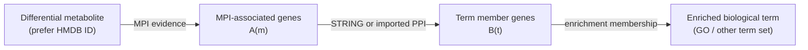

# MyscRNAtools / MetaNetAssoc

`MyscRNAtools` distributes **MetaNetAssoc 0.4.0**: an R package for integrating differential metabolites and differential genes (DEG) through metabolite--protein interaction (MPI) networks, protein--protein interaction (PPI) networks, and DEG enrichment results.

Its central question is not “which metabolite binds which protein?”, but:

> Which differential metabolites have network-supported associations with the biological processes enriched in the differential-gene set?

The result is an auditable set of metabolite--gene--gene--biological-term paths, plus raw, weighted, normalized, and coverage-aware scores.

## Install

### Option 1: install the packaged release

Download [`dist/MetaNetAssoc_0.4.0.tar.gz`](dist/MetaNetAssoc_0.4.0.tar.gz), then run the following in R/RStudio:

```r
install.packages(
  "MetaNetAssoc_0.4.0.tar.gz",
  repos = NULL,
  type = "source"
)

library(MetaNetAssoc)
packageVersion("MetaNetAssoc")
# [1] "0.4.0"
```

### Option 2: install directly from GitHub

```r
install.packages("remotes")
remotes::install_github("Pengzhi-Gao/MyscRNAtools", subdir = "MetaNetAssoc")
```

Optional capabilities need extra packages:

```r
install.packages(c("ggplot2", "igraph"))

install.packages("BiocManager")
BiocManager::install(c(
  "clusterProfiler",
  "org.Hs.eg.db",
  "org.Mm.eg.db"
))
```

## Algorithm overview

MetaNetAssoc uses a four-layer network. For a metabolite `m` and an enriched term `t`, it searches for direct support paths:



For each candidate metabolite, the package:

1. obtains its MPI-associated genes, denoted by `A(m)`;
2. runs or imports DEG enrichment, obtaining genes in each term `B(t)`;
3. finds PPI edges connecting `A(m)` to `B(t)`;
4. retains every supporting path `m → g₁ → g₂ → t`;
5. calculates association scores for each metabolite--term pair.

When `include_overlap = TRUE`, an MPI gene that is itself a member of a term is also retained as a direct `gene_overlap` path. This handles an enzyme/gene that is directly represented in the enriched biological process.

### Scores

For a metabolite--term pair `(m, t)`:

- **`edge_count`** is the number of retained supporting paths.
- **`weighted_sum`** is the sum of MPI evidence weight × PPI confidence (and optional hub adjustment) over retained paths.
- **`possible_pairs = |A(m)| × |B(t)|`** is the number of theoretically possible metabolite-gene / term-gene pairings.
- **`normalized_score = weighted_sum / possible_pairs`** adjusts for large metabolite or term gene sets.
- **`relation_coverage`** is the proportion of MPI genes that connect to a term through PPI or direct overlap.
- **`term_coverage`** is the proportion of a term's genes reached by the metabolite-associated genes.

The raw score highlights amount of evidence; the normalized and coverage scores help prevent very large terms or promiscuous metabolites from dominating solely because they have many possible connections.

## Required inputs

The standard 0.4.0 workflow starts from the following objects.

| Input | Required fields | Purpose |
|---|---|---|
| DEG | gene-symbol vector or data frame with a `gene` column | Starting genes for PPI and enrichment |
| Differential metabolites | HMDB ID vector or data frame with `hmdb_id` | Stable metabolite identifiers, e.g. `HMDB0000122` |
| MPI evidence table | `hmdb_id`/`metabolite_id`, `relation_gene`; optional source and weight fields | Traceable metabolite--gene evidence |
| PPI table | retrieved from STRING or imported with endpoint and score columns | Gene--gene network with confidence |
| Enrichment table | generated by `clusterProfiler` or imported as term--gene data | Defines biological terms and their genes |

### MPI evidence requirements

For a real study, supply an auditable HMDB--gene table. Recommended columns are:

```r
my_mpi_database <- data.frame(
  hmdb_id = c("HMDB0000122", "HMDB0000062"),
  metabolite_name = c("Choline", "L-Carnitine"),
  relation_gene = c("CHKA", "CPT1A"),
  mpi_source = c("curated_source", "curated_source"),
  mpi_weight = c(0.95, 0.90)
)
```

The package includes a small **synthetic** HMDB reference for tutorials only. Do not use it as biological evidence.

## Standard analysis workflow

```r
library(MetaNetAssoc)

# Differential genes and metabolites from your own analysis.
deg <- c("CHKA", "SLC44A1", "CPT1A")
hmdb <- c("HMDB0000122", "HMDB0000062")

# 1. Build PPI from STRING. `score_threshold` is always 0--1000.
ppi <- build_ppi_network(
  deg,
  species = "human",
  score_threshold = 400
)

# 2. Restrict MPI evidence to the supplied DEG and HMDB IDs.
mpi <- build_mpi_network(
  deg,
  hmdb,
  species = "human",
  mpi_database = my_mpi_database
)

# 3. DEG enrichment and export of the original clusterProfiler table.
enr <- run_deg_enrichment(
  deg,
  species = "human",
  ontology = "BP",
  export_file = "GO_enrichment.csv"
)

# 4. Integrate MPI, PPI, and enrichment results.
fit <- run_metanet(
  metabolites = hmdb,
  mpi = mpi,
  ppi = ppi,
  enrichment = enr$enrichment,
  focus_genes = deg
)

# 5. Inspect and plot.
head(result_scores(fit))
result_qc(fit)
plot_term_ranking(fit)
plot_score_heatmap(fit)
plot_association_network(fit)
```

`build_ppi_network()` automatically handles STRING API scores on a 0--1 scale and downloaded STRING tables using 0--1000 scores. If the online query is not available due to firewall or TLS settings, download a STRING edge table and pass it through `string_data` for a fully offline PPI step.

## Diagnosing MPI matches

An empty MPI result is usually a data-overlap issue: the supplied DEG may not be linked to the supplied HMDB metabolites in the selected MPI evidence table.

```r
mpi <- build_mpi_network(deg, hmdb, mpi_database = my_mpi_database)
attr(mpi, "matching_diagnostics")
```

The diagnostic table reports the number of input DEG, input HMDB IDs, DEG symbols present in the MPI database, HMDB IDs present in the MPI database, and the final number of joint MPI edges. A valid edge requires the **same metabolite** to link to at least one supplied DEG.

## Bundled human and mouse MPI references

Version 0.4.0 includes two larger MPI references:

```r
human_mpi <- load_mpi_reference("human")
mouse_mpi <- load_mpi_reference("mouse")
```

| Reference | Size | Origin and limitation |
|---|---:|---|
| Human | 27,945 MPI edges | Project-integrated KEGG, Reactome, Human-GEM, and BRENDA evidence |
| Mouse | 30,963 MPI edges | Ensembl Compara orthology projection of the human evidence |

These reference networks use `metabolite_kegg_id` (KEGG compound IDs), not HMDB IDs. To use them in the HMDB-first workflow, add and document an HMDB--KEGG cross-reference, then expose its HMDB field as `hmdb_id`.

The mouse reference is not independently curated mouse biochemical evidence. It should be interpreted as a cross-species orthology projection.

## Outputs and visualization

`run_metanet()` returns a `MetaNetResult` object. Use these accessors to obtain auditable tables:

| Function | Returns |
|---|---|
| `result_scores(fit)` | Metabolite--term scores and coverage metrics |
| `result_edges(fit)` | Every retained metabolite--gene--gene--term path |
| `result_qc(fit)` | Input, matching, and network coverage QC summary |
| `result_unmatched(fit)` | Unmatched metabolites/genes |
| `result_term_reduction(fit)` | Mapping of redundant terms after reduction |

The package provides `plot_term_ranking()`, `plot_score_heatmap()`, and `plot_association_network()` for common result views. The plotting functions use `ggplot2`; the network plot also needs `igraph`.

## Tutorial and source layout

- [`MetaNetAssoc/`](MetaNetAssoc/) — package source, help pages, test suite, synthetic data, MPI reference data, and examples.
- [`MetaNetAssoc/vignettes/deg-hmdb-workflow.Rmd`](MetaNetAssoc/vignettes/deg-hmdb-workflow.Rmd) — step-by-step DEG + HMDB tutorial.
- [`dist/MetaNetAssoc_0.4.0.tar.gz`](dist/MetaNetAssoc_0.4.0.tar.gz) — installable R source package.

After installation, open the rendered tutorial with:

```r
vignette("deg-hmdb-workflow", package = "MetaNetAssoc")
```

## Interpretation and limitations

MetaNetAssoc identifies **network-supported association potential**. It does not establish direct metabolite binding, regulation direction, causality, or clinical effect. Results should be interpreted alongside metabolite identity confidence, direction and magnitude of DEG/metabolite changes, species, reaction context, and independent experimental validation.
